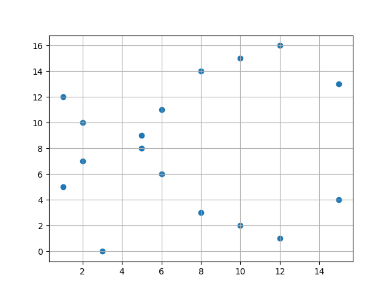

## Introduction

ECC is a modern family of public key cryptosystems and a natural successor of RSA based on the algebraic structures of elliptic curves over finite field and o the Elliptic Curves Discrete logarithm Problem (ECDLP).
ECC implements :
- Encryption
- Signatures
- key exchange
## Advantages
ECC uses :
- Smaller Keys
- Smaller Signatures
- Very fast key generation
- Fast key agreement
- Fast signatures
## Characteristics
### ECC Keys
Private keys are typically  256 bit integers generated randomly
 ex : 
	 hex encoded 32 bytes or 64 hex digits :
	 `0x51897b64e85c3f714bba707e867914295a1377a7463a9dae8ea6a8b914246319`

Public keys are ECC points i.e. pares of integer coordinates (x,y) laying on the elliptic curve.  EC points can be compressed to one coordinate + 1 bit (odd or even). Thus, the public key is 256 bit ECC key + 1 bit for parity = 257 bit integer.
ex : 
	corresponding to the above private key, encoded in the Ethereum format, as hex with prefix `02` or `03` so a size of 33 bytes or 66 hex digits  which can be optimised to exactly 257 bits) :
	`x02f54ba86dc1ccb5bed0224d23f01ed87e4a443c47fc690d7797a13d41d2340e1a`
## Curves
ECC algorithms use different elliptic curves and depending on level of security, speed and key lengths.
ECC curves used in cryptographic libraries are named (ex. sec256k1 or Curve2519)
## Algorithms
ECC provides :
- Digital signature algorithms ex. ECDSA and EdDSA
- ECC encryption algorithms ex. ECIES and EEECC
- ECC key agreement algorithms ex. ECDH, X2519 and FHMQV
These algorithms use curves like secp256k1, curve25519 or p521 for there calculation and rely on the discrete logarithm problem. The private key is an integer and the public key is a point on the elliptic curve.
## Mathematical introduction to Elliptic Curves
Elliptic curves are plane algebraic curves consisting of $(x,y)\in\mathbb R^2$ points described by the equation :
$$Ax^3 +Bx^2y + Cxy^2 + Dy^3 +Ex^2 + Fxy + Gy^2 + Hx + Iy + j = 0$$
Together with an "imaginary" point  at infinity  denoted as $\mathbb O$ .
In cryptography, elliptic curves over $\mathbb Z_p$, $p\gt 3$, are simplified in the Weierstrass form defined as $(x,y)\in\mathbb Z_p$ , $a,b \in \mathbb Z_p$ :
$$y^2 = x^3 + ax + b$$
$$4a^3+27b^2\neq0$$
furthermore,  ECC curves are defined over the finite fields $F_p$  where p is prime, or, $F_2^m$ and the points on the curve are limited to the integer coordinates within the field. Algebraic operations within the field result in a point within the field.
Consequently, the equation of the curve become :
$$y^2 \equiv x^3 + ax + b\pmod p$$
$$4a^3+27b^2\not\equiv 0\pmod p$$

The ECC uses (x, y) points within the Galois field  $F_p$  such that $x,y \in [0;p-1]$
### Exemple of Elliptic curve
the following code plots the curve $y^2 = x^3 + 7[17]$ :
```
import matplotlib.pyplot as plt  
import pandas as pd  
  
def generate_curve(a, b, p):  
    curve = {  
        'X' : [],  
        'Y' : []  
    }  
    for x in range(p):  
        for y in range(p):  
            if (( y**2 - (x**3 + a*x + b) ) % p) == 0:  
                curve['X'].append(x)  
                curve['Y'].append(y)  
    return curve  
  
  
if __name__ == '__main__':  
    df = pd.DataFrame(generate_curve(0, 7, 17))  
    plt.scatter(df['X'], df['Y'])  
    plt.grid()  
    plt.show()
```


### Operation on EC Points
#### Point operation

##### Point at infinity
the point at infinity denoted $\mathbb O$ is the identity element of the elliptic curve arithmetic, so :
$$\mathbb O + \mathbb O = \mathbb O$$
$$\mathbb O + P =  P$$
for P point on the curve
##### Point negation
$$P + (-P) =\mathbb O$$
For EC of the forme $y^2= x^3 + ax +b$ the above negation of P = (x, y) on the elliptic curve results in the following :
$$(x, y) + (- (x, y)) = O$$
$$(x, y) + (x, -y) = O$$
so :
$$-(x, y) = (x, -y)$$
This is a direct result of the symmetry of the EC over the Y axis. 
##### Point addition
Let P, Q points on the curve; addition of P and Q, R is defined as the negation of the result of the intersection of the curve and the strait line that passes by P and Q.
Assuming th EC described by $y^2= x^3 + ax +b$, $R=(x_r,y_r)$, $P=(x_p,y_p)$ and $Q=(x_q,y_q)$. It can be calculated that :
$$\lambda=\frac{y_q-y_p}{xq-xp}$$
$$x_r=\lambda^2-x_p-x_q$$
$$y_r=\lambda(x_p-x_r)-y_p$$
such that : 
$$P,Q \neq \mathbb O \text{ and } P \neq Q$$
###### Proof
The line $(L): y=\lambda x + \beta$ passes by the points $P=(x_p,y_p)$ and $Q=(x_q,y_q)$ such that $P\neq Q$ and $C=(x_c,y_c)$ and let $R=(x_r,y_r)$ such that $P + Q = R$ on the elliptic curve $(C): y^2=x^3 + ax + b$  therefore :
the slope $\lambda$ is equal to : 
$$\lambda = \frac{y_q-y_p}{x_q-xp}$$
 and $\beta$ is therefore :
$$\beta = y_p-\lambda x_p$$
 By substitution $y$ from the line equation in the elliptic cure equation, we get :
$$(\lambda x + \beta)^2 = x^3 + ax+b$$
$$x^3-\lambda^2x^2+(a-2\lambda\beta)x +(b-\beta^2) = 0$$
But, P and Q are solution to the above equation since they are points on  (C) and (L) by construction. Therefore, by Euclidean division over $(x-x_p)(x-x_q)$ we find :

$\underline{x^3-\lambda^2x^2+(a-2\lambda\beta)x +(b-\beta^2) = 0}$                                         | $\underline{x^2-(x_p+x_q)x+x_px_q}$
$-x^3+(x_p+x_q)x^2-x_px_qx$                                                           | $x+(x_p+x_q-\lambda^2)$
$(x_p+x_q-\lambda^2)x^2+(a-2\lambda\beta-x_px_q)x+(b-\beta^2)$                         | 
$(x_p+x_q-\lambda^2)x^2+(x_p+x_q-\lambda^2)(x_px_q)x-(x_p+x_q-\lambda^2)x_px_q$  |

and the reminder is equal to 0 since P and Q's x-coordinates are solutions to the equation.
Therefore :
$$x+(x_p+x_q-\lambda^2) = 0$$
$$x_c=(\lambda^2-x_p-x_q)$$
and it follows that :
$$y_c = \lambda x_c+y_p-\lambda x_p$$
Finally, since $R = - C$ then $(x_r,y_y) = (x_c,-y_c)$, therefore :
$$x_r=(\lambda^2-x_p-x_q)$$
$$y_r = -\lambda(x_p-x_r)-y_p$$

##### Point doubling
When P and Q of the curve are coincident, the result R is the mirror point over the Y axis of the intersection of tangente to the curve at P and the EC and thus :
$$\lambda=\frac{3x_p^2+a}{2y}$$
###### Proof
the slope of the tangent to $C$ is calculated from it's equation and using improper differentiation as such :
$$y^2=x^3+ax+b$$
$$2ydy = (3x^2+a)dx$$
but :
$$\lambda(x,y) = \frac{dx}{dy}$$
so : 
$$\lambda(x,y) = \frac{3x^2+a}{2y}$$
In conclusion :
$$\lambda = \frac{3x_p^2+a}{2y_p}$$
and the coordinates of R are :
$$x_r=\lambda^2-2x_p$$
$$y_r=\lambda(x_p-x_r)-y_p$$
##### Remark 
In elliptic curve cryptography, the division operation becomes the modular inverse operation $a*a^-1\equiv \pmod p$.
##### Point multiplication
Given the EC $(E): y^2=x^3+ax+b$, point multiplication is defined as the repeated addition of a point $P=(x,y) \in (E)$ to itself :
$$nP=\underbrace{P+P+P+P+\dots+P}_{n}$$
Multiple algorithms implement point multiplication in a more efficient way than the straightforward approche of repeated addition such ad Double and Add and the Montgomery Ladder.
###### Double and Add
To compute $S=nP$, we start with the binary representation of n noted $nb[0..l[, l=log_2(n)$ and we define add(P,Q) and double(P) as the point addition and multiplication on the EC $(E):y^2\equiv x^3+ax+b)\pmod p$ and $4a^3+27b^2\not\equiv 0\pmod p$ :
```
let R = P
for i from l-2 to 0:
	R = double(R)
	if nb[i] == 1:
		R = add(R, P)
return R
```
#### Order and Cofactor of an Elliptic Curve
Points on a elliptic curves 
$$(E):y^2\equiv x^3+ax+b)\pmod p \text{  }4a^3+27b^2\not\equiv 0\pmod p$$
form cyclic algebraic groups i.e. the addition or multiplication by integers of points of the groupe results in another point in the groupe.
the order $n\in \mathbb N$ of the curve is the number of points on the curve including the infinity point $\mathbb O$. each curve can be composed of $h\in \mathbb N$ cyclic subgroups and each has an order of $r\in \mathbb N$ including the infinity point $\mathbb O$.
Therefore, the cofactor expressed as :
$$h=\frac{n}{r}$$
Examples:
- The elliptic curve `secp256k1` has a cofactor = 1.
- The elliptic curve `Curve25519` has a cofactor = 8.
- The elliptic curve `Curve448` has a cofactor = 4.
#### Generator points
A generator point G on an elliptic curve is a point from which you can calculate any other point from a cyclic subgroup of order $r$ on the curve by multiplying G by an integer $i\in[0..r]$.
## Elliptic Curve Discrete Logarithm Problem
Given an elliptic curve $E$ of order $\\#E=n$. We consider a primitive element (Generator) $P$ and another element $T$ of $E$. The DL problem is finding the integer $d$ where $1\le d \le n$, such that :
$$\underbrace{P+P+P+P+\dots+P}_{\text{d times}}=dP=T$$
### Hasse's Theorem
Given an elliptic curve E modulo p, the number of points on the curve is denoted by $\\#E$ and is bounded by :
$$p+1-2\sqrt{p}\le \\#E\le+1+2\sqrt{p}$$
### Computational Difficulty of ECDLP
If the Elliptic curve modulo p is chosen carefully, the best known algorithms for computing the ECDLP requires roughly $\sqrt{p}$ steps to compute.
In practice, the integer p is a very large prime number of n bits binary representation such that the modular inverse is always computable.  Therefore, the rough number of steps required is of the order :
$$\sqrt{p}\approx 2^\frac{n}{2}$$
Typically, 256-bits elliptic curves provide slightly less than128-bit security strength because the order of the curve $n$ is less than $p$ and the cofactor $h\lt 1$ for instance :
- The secp256k1 (p = 256) curve provides ~ 128-bit security (127.8 bits to be precise)
- The Curve448 (p = 448) provides ~ 224-bit security (222.8 bits to be precise).
## Elliptic Curve Diffie-Hellman
Using elliptic curves in cryptography requires defining a set of parameters. Generally for the elliptic curve over the finite field $\mathbb F_p$:
$$y^2 \equiv x^3 + ax + b\pmod p$$
$$4a^3+27b^2\not\equiv 0\pmod p$$
- The generator point $G=(x_g,y_g)$
- The order of the curve $n$
- The cofactor of the curve $h$
- An integer k which will serve as private key noted $K_pr$
- A public key $P=(x_p,y_p)\in (E)$ noted $K_pub$

The protocol of ECDH follows these steps :

Alice                                                                                               Bob
                                   Share EC parameters above
Generate random integer                                    Generate random integer
$a=K_{prA} \in \{2,3, \dots, n-1\}$                               $b=K_{prB} \in \{2,3, \dots, n-1\}$

$A = K_{pubA}= aG = (x_B,y_B)$                                $B = K_{pubB}= bG = (x_B,y_B)$
											Alice sends A to Bob
											Bob sends B to Alice
Calculate $K = aB=(x_AB,y_AB)$                     Calculate $K = bA=(x_AB,yAB)$
In the end $K$ is known by Alice and Bob and can be used as a secret key.