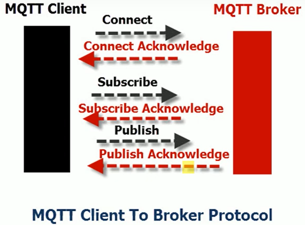
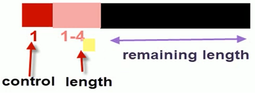
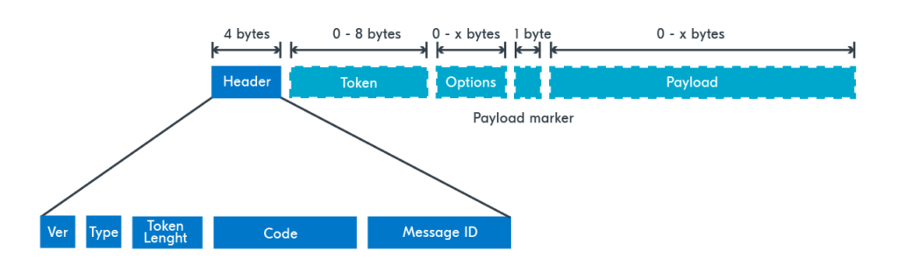

# Message Queuing Telemetry Transport (MQTT)
## General description

MQTT is a lightweight broker based publish/subscribe messaging protocol designed for constrained environments such as :
- Low bandwidth or unreliable network.
- Limited memory and processor like embedded devices.
It's features are :
- Publish/subscribe message pattern for one to many message distribution.
- Message transport agnostic to it's content.
- Use of basic TCP/IP.
- Small transport overhead with fixed header length of 2 bytes and reduced trafic.
- A mechanism to notify abnormal disconnections (Last Will and Testament).
- Three possible qualities of message delivery :
	- "At most once" : Messages loss and duplication occur.
	- "At least once" : Messages are assured to arrive with potential duplicates.
	- "Exactly once" : Messages are assured to arrive exactly once.
## General View of MQTT Protocol
Communication between the MQTT client and broker can be represented like this :

## MQTT Packet Sizes
MQTT packets have three main parts : Control, Packet length, Remaining length.

- The control field is 1 byte long.
- the Length field which describes the size of the remaining length and can vary from 1 byte to 4 bytes. 
- Each byte of the Length field starts with continuation bit, therefor the remaining length field can be of a maximum size of $2^28=268 435 456\text{ bits} = 256 \text{MB}$
- The minimum packet size(disconnect packet) is just 2 bytes long
# Constrained Application Protocol (CoAP)
## General description
CoAP, short for Constrained Application Protocol, is a specialized web transfer protocol, based on UDP and REST, tailored for use in networks with constrained nodes and limited resources, such as low-power microcontrollers with small ROM and RAM (Often 8-bits microcontrollers). These networks, like IPv6 over Low-Power Wireless Personal Area Networks (6LoWPANs), often face challenges such as high packet error rates and modest throughput (typically in the range of 10s of kbit/s). CoAP is specifically designed for machine-to-machine (M2M) applications like smart energy and building automation.

This protocol facilitates a request/response interaction model between application endpoints and includes built-in discovery of services and resources . It incorporates Uniform Resource Identifiers (URIs) and Internet media types. CoAP is engineered for easy integration with HTTP,  all while addressing unique demands like multicast support, minimal overhead, and simplicity for resource-constrained environments.
## General View Of CoAP Protocol
CoAP uses a request/response model based on REST with similar request messages : GET, POST, PUT and DELETE. The responses are generally one of three messages : SUCCESS, ERROR, SERVER ERROR.

Generally a CoAP packet looks like this :

## Security of CoAP
CoAP defines four security modes:

- "NoSec", where DTLS is disabled
- "PreSharedKey", where DTLS is enabled, there is a list of pre-shared keys, and each key includes a list of which nodes it can be used to communicate with. Devices must support the AES cipher suite.
- "RawPublicKey", where DTLS is enabled and the device uses an asymmetric key pair without a certificate, which is validated out of band. Devices must support the AES cipher suite and Elliptic Curve algorithms for key exchange. More specifically, The RFC7552 section 9.1.3.2 states that : 
```
	Implementations in RawPublicKey mode MUST support the mandatory-to-implement cipher suite TLS_ECDHE_ECDSA_WITH_AES_128_CCM_8 as specified in [RFC7251], [RFC5246], and [RFC4492].  The key used MUST be ECDSA capable.  The curve secp256r1 MUST be supported [RFC4492]; this curve is equivalent to the NIST P-256 curve.  The hash algorithm is SHA-256
```
- "Certificate", where DTLS is enabled and the device uses X.509 certificates for validation.

## Packet sizes
RFC7552 section 4.6 states that :
```
If the Path MTU is not known for a destination, an IP MTU of 1280 bytes SHOULD be assumed; if nothing is known about the size of the headers, good upper bounds are 1152 bytes for the message size and 1024 bytes for the payload size.
```
# Object Security for Constrained RESTful Environments (OSCORE)
OSCORE is an optional functionality of CoAP. It provides end-to-end protection between endpoints communicating using CoAP or CoAP-mappable HTTP.
OSCORE encrypts and integrity protects the CODE and PAYLOAD filed of CoAP Packet as described in RFC8613. This is done using CBOR Object Signing and Encryption (COSE) RFC8152.
## Key Exchange
Key exchange in this protocol can be done using Elliptic Curve Diffie Hellman(ECDH) to be used with the curves P-256, P-384, P-521, X25519, and X448. Depending on the specificity of each curve, other steps might be added to make the processed key more secure for transmission such as calculating the HMAC of the key or using only the X coordinate of the resulting Point (Key Derivation Algorithm).
Other details are also set in the RFC specifying whether each curve can be used for exchanging the same key or multiple keys (Ephemeral-Static or Static-Static)
## Signing
Signing In this protocol can be done using different methods, among them ones using ECC such that :
- Elliptic Curve Digital Signature Algorithm(ECDSA) as defined by RFC6979 and only for the curves P-256, P-384, and P-521
- Edwards-Curve Digital Signature Algorithms(EdDSA) as defined by RFC8032 and only with the curves edwards25519 and edwards448
# Transport Layer Security (TLS 1.3)
## General description
Transport Layer Security (TLS) protocol.  TLS is designed to protect client/server applications from eavesdropping, tampering, and message forgery.
The primary goal of TLS is to provide a secure channel between two peers communicating through a reliable, in-order data stream.  This secure channel provides the following properties:
- **Authentication** : The server side of the channel is always authenticated; the client side is optionally authenticated. Authentication can happen via asymmetric cryptography :
  - RSA
  - Elliptic Curve Digital Signature Algorithm (ECDSA)
  - Edwards-Curve Digital Signature Algorithm (EdDSA)
  - A symmetric pre-shared key (PSK).

- **Confidentiality** : Data sent over the channel after establishment is only visible to the endpoints. 
- **Integrity** : Data sent over the channel after establishment cannot be modified by attackers without detection.
## General View of TLS Protocol
After the client and server agree to use TLS (Through the use of port 443 or , they negotiate a stateful connection by using a handshaking procedure by sending "Client Hello" and "Server Hello" messages. 
The protocol uses a handshake with an asymmetric cipher to establish not only cipher settings but also a session-specific shared key with which further communication is encrypted.
Generally, the handshake begins when a client connects to a TLS-enabled server requesting a secure connection and the client presents a list of supported cipher suites (ciphers and hash functions). From this list, the server picks a cipher and hash function that it also supports and notifies the client.
Then, the server provides identification in the form of a digital certificate containing the server name, the trusted certificate authority (CA) that vouches for the authenticity of the certificate, and the server's public encryption key. The client confirms the validity of the certificate. To generate the session keys used for the secure connection, the client either:
- encrypts a random number (PreMasterSecret) with the server's public key and sends the result to the server (which only the server should be able to decrypt with its private key); both parties then use the random number to generate a unique session key for subsequent encryption and decryption of data during the session
- Uses Diffie–Hellman key exchange (or more interestingly for us, its variant Elliptic Curve Diffie Hellman) to securely generate a random and unique session key for encryption and decryption that is forward secure (i.e. if the server's private key is disclosed, it cannot be used to decrypt the current session, even if the communication is intercepted).
After that, all communication are encrypted using the session key until the session closes.
## Elliptic Curve Diffie Hellman  (ECDH) in TLS
Usually ECDH Ephemeral type is used to create a public-private key pair on the fly for each session. Further more, RFC8446 states that :
```
The negotiated key (Z) is converted to a byte string by encoding in big-endian form and left-padded with zeros up to the size of the prime.
```
It must, also, be noted that a key derivation function (KDF i.e. a hash function) is applied to the shared secret x-coordinate of the ECDH shared secret elliptic curve point represented as an octet string which has constant length for any given field of given elliptic curve.
Supported curves on the OPENSSL standard can be shown with the command :
```
openssl ecparam -list_curves
secp112r1 : SECG/WTLS curve over a 112 bit prime field
secp112r2 : SECG curve over a 112 bit prime field
secp128r1 : SECG curve over a 128 bit prime field
secp128r2 : SECG curve over a 128 bit prime field
secp160k1 : SECG curve over a 160 bit prime field
secp160r1 : SECG curve over a 160 bit prime field
secp160r2 : SECG/WTLS curve over a 160 bit prime field
secp192k1 : SECG curve over a 192 bit prime field
secp224k1 : SECG curve over a 224 bit prime field
secp224r1 : NIST/SECG curve over a 224 bit prime field
secp256k1 : SECG curve over a 256 bit prime field
secp384r1 : NIST/SECG curve over a 384 bit prime field
secp521r1 : NIST/SECG curve over a 521 bit prime field
prime192v1: NIST/X9.62/SECG curve over a 192 bit prime field
prime192v2: X9.62 curve over a 192 bit prime field
prime192v3: X9.62 curve over a 192 bit prime field
prime239v1: X9.62 curve over a 239 bit prime field
prime239v2: X9.62 curve over a 239 bit prime field
prime239v3: X9.62 curve over a 239 bit prime field
prime256v1: X9.62/SECG curve over a 256 bit prime field
sect113r1 : SECG curve over a 113 bit binary field
sect113r2 : SECG curve over a 113 bit binary field
sect131r1 : SECG/WTLS curve over a 131 bit binary field
sect131r2 : SECG curve over a 131 bit binary field
sect163k1 : NIST/SECG/WTLS curve over a 163 bit binary field
sect163r1 : SECG curve over a 163 bit binary field
sect163r2 : NIST/SECG curve over a 163 bit binary field
sect193r1 : SECG curve over a 193 bit binary field
sect193r2 : SECG curve over a 193 bit binary field
sect233k1 : NIST/SECG/WTLS curve over a 233 bit binary field
sect233r1 : NIST/SECG/WTLS curve over a 233 bit binary field
sect239k1 : SECG curve over a 239 bit binary field
sect283k1 : NIST/SECG curve over a 283 bit binary field
sect283r1 : NIST/SECG curve over a 283 bit binary field
sect409k1 : NIST/SECG curve over a 409 bit binary field
sect409r1 : NIST/SECG curve over a 409 bit binary field
sect571k1 : NIST/SECG curve over a 571 bit binary field
sect571r1 : NIST/SECG curve over a 571 bit binary field
c2pnb163v1: X9.62 curve over a 163 bit binary field
c2pnb163v2: X9.62 curve over a 163 bit binary field
c2pnb163v3: X9.62 curve over a 163 bit binary field
c2pnb176v1: X9.62 curve over a 176 bit binary field
c2tnb191v1: X9.62 curve over a 191 bit binary field
c2tnb191v2: X9.62 curve over a 191 bit binary field
c2tnb191v3: X9.62 curve over a 191 bit binary field
c2pnb208w1: X9.62 curve over a 208 bit binary field
c2tnb239v1: X9.62 curve over a 239 bit binary field
c2tnb239v2: X9.62 curve over a 239 bit binary field
c2tnb239v3: X9.62 curve over a 239 bit binary field
c2pnb272w1: X9.62 curve over a 272 bit binary field
c2pnb304w1: X9.62 curve over a 304 bit binary field
c2tnb359v1: X9.62 curve over a 359 bit binary field
c2pnb368w1: X9.62 curve over a 368 bit binary field
c2tnb431r1: X9.62 curve over a 431 bit binary field
wap-wsg-idm-ecid-wtls1: WTLS curve over a 113 bit binary field
wap-wsg-idm-ecid-wtls3: NIST/SECG/WTLS curve over a 163 bit binary field
wap-wsg-idm-ecid-wtls4: SECG curve over a 113 bit binary field
wap-wsg-idm-ecid-wtls5: X9.62 curve over a 163 bit binary field
wap-wsg-idm-ecid-wtls6: SECG/WTLS curve over a 112 bit prime field
wap-wsg-idm-ecid-wtls7: SECG/WTLS curve over a 160 bit prime field
wap-wsg-idm-ecid-wtls8: WTLS curve over a 112 bit prime field
wap-wsg-idm-ecid-wtls9: WTLS curve over a 160 bit prime field
wap-wsg-idm-ecid-wtls10: NIST/SECG/WTLS curve over a 233 bit binary field
wap-wsg-idm-ecid-wtls11: NIST/SECG/WTLS curve over a 233 bit binary field
wap-wsg-idm-ecid-wtls12: WTLS curve over a 224 bit prime field
Oakley-EC2N-3:
	IPSec/IKE/Oakley curve #3 over a 155 bit binary field.
	Not suitable for ECDSA.
	Questionable extension field!
Oakley-EC2N-4:
	IPSec/IKE/Oakley curve #4 over a 185 bit binary field.
	Not suitable for ECDSA.
	Questionable extension field!
brainpoolP160r1: RFC 5639 curve over a 160 bit prime field
brainpoolP160t1: RFC 5639 curve over a 160 bit prime field
brainpoolP192r1: RFC 5639 curve over a 192 bit prime field
brainpoolP192t1: RFC 5639 curve over a 192 bit prime field
brainpoolP224r1: RFC 5639 curve over a 224 bit prime field
brainpoolP224t1: RFC 5639 curve over a 224 bit prime field
brainpoolP256r1: RFC 5639 curve over a 256 bit prime field
brainpoolP256t1: RFC 5639 curve over a 256 bit prime field
brainpoolP320r1: RFC 5639 curve over a 320 bit prime field
brainpoolP320t1: RFC 5639 curve over a 320 bit prime field
brainpoolP384r1: RFC 5639 curve over a 384 bit prime field
brainpoolP384t1: RFC 5639 curve over a 384 bit prime field
brainpoolP512r1: RFC 5639 curve over a 512 bit prime field
brainpoolP512t1: RFC 5639 curve over a 512 bit prime field
SM2       : SM2 curve over a 256 bit prime field
```
# Elliptic Curve Cryptography in Blockchain
ECC is used at multiple levels on blockchain systems. Obviously, SSL/TLS with ECC are used to secure transmissions through ECDH(E), but, what is specific to blockchain is signing.
For instance, Bitcoin uses Elliptic Curve Digital Signature Algorithm with the curve Secp256k1 to sign transactions. A simplified version is described below :
After establishing each party's Private and Public keys, Alice wants to send 6 bitcoins to Bob.
Assuming Alice owns the necessary coins, all she needs to do is sign the message :
6 : @Alice -> @Bob and broadcast it to the bitcoin network.
## General view of ECDSA
Signing in ECDSA is done through these steps assuming $d_A$ is a private key number and $Q_A$ is a public key for Alice  and z is the hash of the message above (SHA256 in the bitcoin case):
- We generate a random number k between 1 and n-1 where n is the group order of the curve.
- Compute $(x, y) = k*G$, where G is the generator point of the curve (secp256k1 in the bitcoin case)
- Compute $r \equiv x \pmod n$. If $r=0$, generate another random k and start over.
- Compute $s \equiv k^{-1}(z + r*d_A) \pmod n$. If $s=0$, generate another random k and start over
The pair $r\text{ and } s$ are the signature of $z$ for the $K_{pr} = d_A$.
On the Other hand, Verifying the signature is done as such :
Let the signature pair $r$ and $s$, $K_{pub} = Q_A$ and $z$ the message that was signed.
- Verify  $1\le r,s\le n-1$
- Compute $`u_1 \equiv z*s^{-1} \pmod n\text{ and }u2 \equiv r*s{-1} \pmod n`$
- Compute $`(x, y) = u_1*G + u_2*Q_A \neq \infty`$
- If $r \equiv x \pmod n$ then the signature is valid. Otherwise, or if any of the checks fail, then the signature is invalid.
### Remark
Signature size in the case of Bitcoin is 256 bits as set by secp256k1.